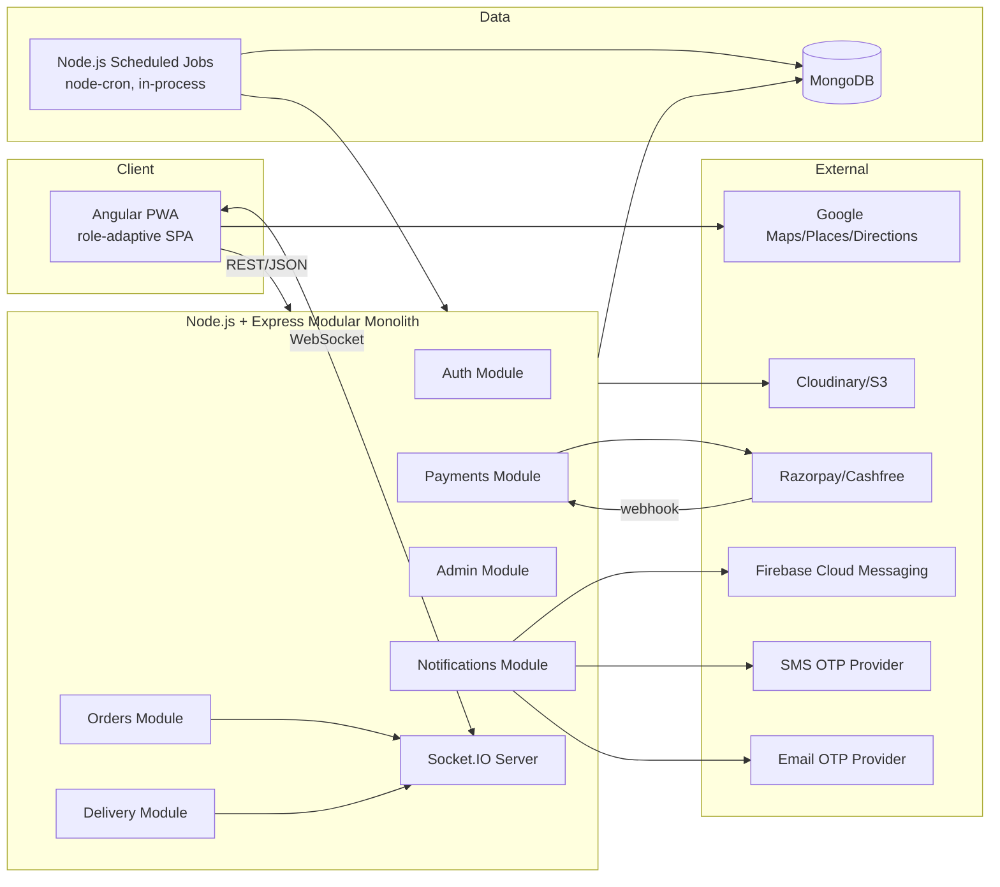

# System Architecture

## 1. Overview

**Version 1 (LOCKED)** — MEAN-stack modular monolith: single Angular PWA (packaged for Android via Capacitor), single Node.js + Express API, MongoDB as the sole datastore, Socket.IO for realtime, Node.js scheduled jobs (`node-cron`) for background/maintenance work, external providers behind abstraction interfaces. Target scale: **fewer than 1,000 orders/day**, single backend instance.

No Redis, no message/job queue (BullMQ/Kafka/RabbitMQ), no microservices, no Kubernetes, no dedicated search engine (Elasticsearch/OpenSearch), and no distributed cache are part of Version 1. These are explicitly deferred — see "Future-Scaling Rule" (§7) below.

## 2. Monorepo Layout

```text
apps/
  web/                     # Angular application (all roles, lazy-loaded)
  api/                     # Node.js + Express application (modular monolith)
libs/
  shared-types/            # Cross-cutting TS interfaces/enums (Order, Role, DTO contracts)
  shared-utils/             # Pure helper functions (formatting, geo, money)
  shared-validation/       # Shared Zod/Joi request-validation schemas, constants (regex, limits)
docs/                      # This documentation set
```

### 2.1 apps/web structure

```text
apps/web/src/app/
  core/                    # Singleton services, interceptors, guards, app-wide config
  shared/                  # Reusable UI components, pipes, directives (role-agnostic)
  features/
    auth/                  # /auth — OTP login, session
    customer/              # /customer/*
    restaurant/             # /restaurant/*
    delivery/              # /delivery/*
    admin/                 # /admin/*
```

Each `features/<role>` area is a lazy-loaded route group guarded by Angular route guards that consult the resolved role/permissions from the auth state (`RoleGuard` + `PermissionGuard` functions). Shared building blocks (buttons, cards, form controls, map wrapper, currency pipe) live in `shared/` and are reused across all four role areas — no duplication.

### 2.2 apps/api structure (Express modules)

```text
apps/api/src/
  modules/                 # one folder per domain module, each owning its router/controller/service/model
    auth/                  # OTP, JWT, refresh, sessions
    users/
    restaurants/
    restaurant-applications/
    menu/                  # categories, items, add-ons
    carts/
    orders/                # state machine, snapshotting
    payments/              # gateway abstraction, webhooks
    delivery/              # partner profile, assignments, status, location updates (tracking data lives here — see sockets/ below for the realtime transport)
    coupons/
    reviews/
    notifications/         # push/SMS/email dispatch (triggered directly by domain events)
    admin/                 # dashboard, reports, platform config, banners/offers (marketing), audit logs
    common/                # auth/role/permission middleware, error handler, request-validation helpers
  sockets/                 # Socket.IO server setup + realtime-events.service.ts (order/tracking namespaces, room joins/emits)
  scheduled-jobs/          # node-cron jobs: order timeout checks, notification retry
  scripts/                 # one-off ops scripts (e.g. seed-dev.ts — dev-only demo data, never run in production)
  config/                  # env validation, typed config
  db/                      # Mongoose connection setup
  app.ts                   # Express app assembly (middleware, routers, error handler)
  server.ts                # HTTP + Socket.IO server bootstrap
```

Each module under `modules/<name>` follows a consistent internal shape: `<name>.router.ts` (Express `Router`, wires middleware + controller), `<name>.controller.ts` (request/response handling), `<name>.service.ts` (business logic), `<name>.model.ts` (Mongoose schema/model), `<name>.validation.ts` (Zod/Joi request schemas).

## 3. High-Level System Diagram



## 4. Key Architectural Decisions

| Decision | Rationale |
|---|---|
| Single Angular app, role-based lazy routes | One codebase to maintain, shared design system, faster iteration; role UX segregated via routing + guards, not separate apps. |
| Modular monolith (Express routers/modules) | Scale (< 1,000 orders/day, single instance) does not justify microservices overhead; module boundaries keep future extraction possible. |
| Node.js + Express (not NestJS) | Simpler runtime footprint and fewer framework abstractions for a small team at this scale; RBAC/permissions/validation implemented as explicit Express middleware instead of decorators/DI. |
| Backend-owned order state machine | Prevents client-driven invalid transitions; single source of truth for business rules. |
| PaymentGateway interface | Decouples business logic from Razorpay/Cashfree specifics; server-side verification only. |
| LocationService abstraction (web/Capacitor) | Browser Geolocation API for Version 1 web/PWA; same interface implemented natively when packaged via Capacitor for Android, without touching business logic. |
| MongoDB TTL indexes + Node.js scheduled jobs (`node-cron`) | Replace Redis/BullMQ for OTP expiry, rate limiting, order timeouts, payment reconciliation and retries — sufficient for a single-instance, sub-1,000-orders/day deployment. |
| No caching layer | MongoDB indexes, pagination, and projections are sufficient at current scale; a cache is added later only if measured latency/load requires it. |
| Socket.IO (single instance, no adapter) | Order-scoped and partner-scoped rooms for realtime tracking without broadcasting to all clients; no Redis adapter needed while running a single backend instance. |

## 5. Cross-Cutting Concerns

- **AuthN/AuthZ**: JWT access (short-lived) + refresh (rotating, stored hashed), applied via Express middleware chain — `authenticate` (verifies JWT) → `requireRole(...)` (coarse) → `requirePermission(...)` (fine-grained) — mounted on each router. See `ROLE-PERMISSIONS.md`.
- **Validation**: Request DTOs validated with Zod (or Joi) schemas via a shared `validate(schema)` Express middleware at every route boundary; shared schemas in `libs/shared-validation` reused by Angular reactive forms where practical.
- **Realtime**: One Socket.IO server attached to the Express HTTP server, with per-module namespaces/handlers (orders, tracking) and room-per-order/room-per-partner; JWT-authenticated handshake; single Node process, no cross-instance adapter required at current scale.
- **Background/scheduled work**: `node-cron` scheduled jobs (registered at server bootstrap) reading/writing MongoDB directly — OTP cleanup, unpaid-order expiration, payment reconciliation, order timeout checks, scheduled reports. No queue system (BullMQ/Kafka/RabbitMQ) in Version 1.
- **Observability**: Structured logging (e.g. `pino`/`winston`), request-id correlation middleware, audit log collection for sensitive actions (approvals, cancellations, refunds).
- **Configuration**: Typed, validated env config (`dotenv` + a Zod/Joi env schema checked at boot, fail-fast if invalid); no secrets in source.

## 6. Deployment Topology (Phase 13 target)

Docker Compose services: `web` (Nginx-served Angular build), `api` (Node.js + Express, single instance, scheduled jobs run in-process), `mongo`. No `redis` service, no worker/queue service in Version 1.

## 7. Future-Scaling Rule

> Version 1 uses Angular + Capacitor + Node.js + Express + MongoDB + Socket.IO as a modular monolith. Additional infrastructure must not be introduced unless a measurable technical or functional requirement justifies it. Future scaling technologies may be introduced through a documented architecture change.

Examples of possible future reasons that could justify revisiting this rule (none apply today, none are implemented today):

- Multiple backend instances (would require a Socket.IO adapter and/or distributed rate limiting).
- Distributed rate limiting or distributed locks across instances.
- High-volume asynchronous processing that in-process cron can no longer handle reliably.
- Distributed caching driven by measured database load.
- WebSocket horizontal scaling needs.
- Significantly increased traffic/concurrency beyond the ~1,000 orders/day design point.
