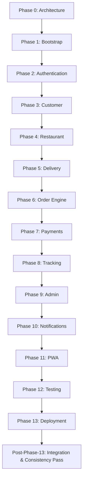
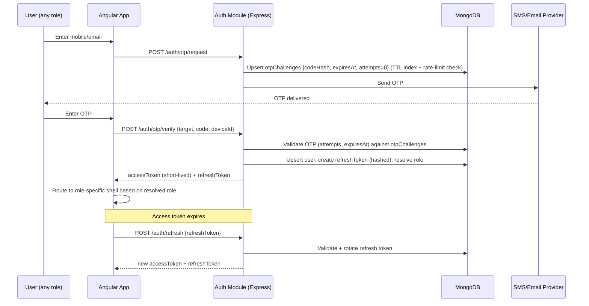
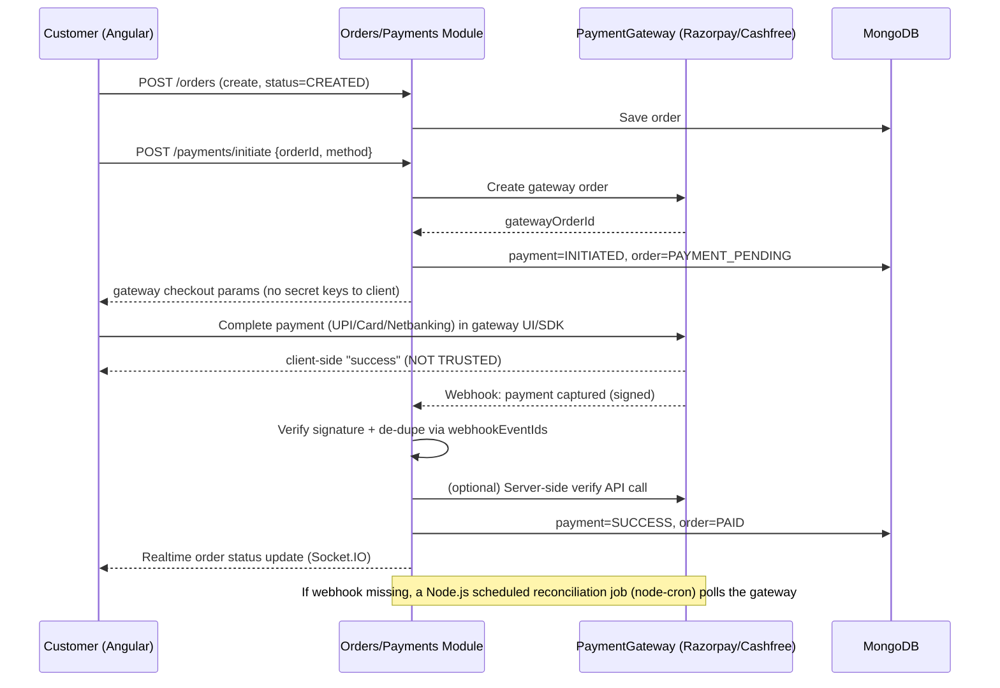
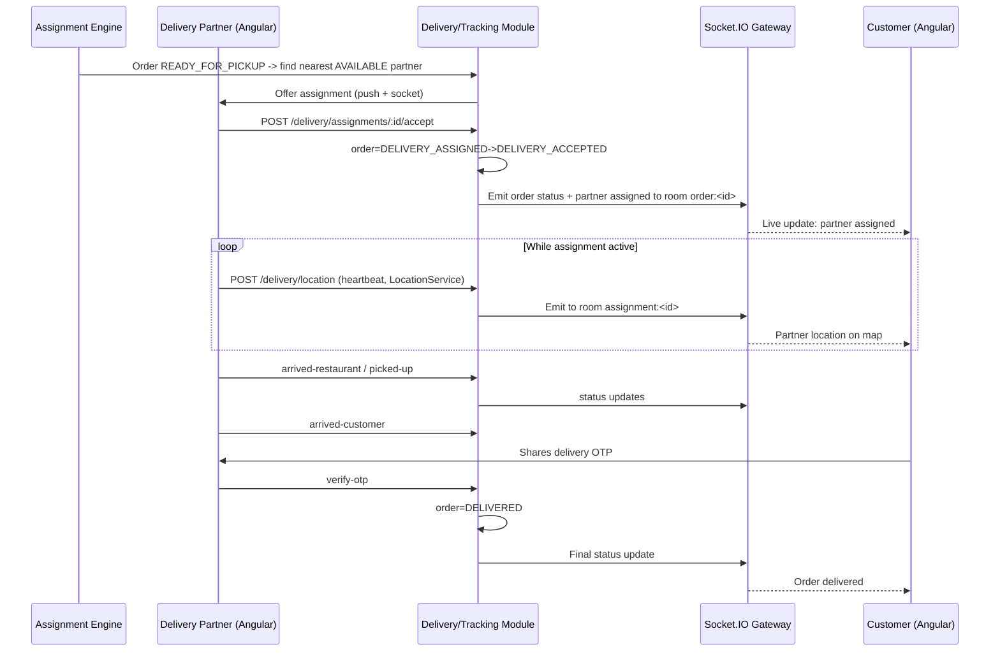

# Development Plan

## 1. Phased Delivery Sequence

Each phase must end with a working build (`ng build` for the Angular app / `tsc` build (or `npm run build`) for the Express API succeed) before moving on. Test cases and lint are skipped for now per current instructions, but build errors must be fixed before closing a phase.

**Phases 0–13 are complete** (see `TASKS.md` for the authoritative, per-item checklist). The Post-Phase-13 pass is not a new architectural phase — it is a completion/integration/documentation-consistency pass over the existing application, explicitly scoped to closing gaps identified by a self-audit rather than adding features (see §7 below).

## 2. Phase Scope Definitions

- **Phase 1 — Bootstrap**: Monorepo scaffolding (`apps/web`, `apps/api`, `libs/*`), Angular standalone app shell with lazy route stubs for `auth/customer/restaurant/delivery/admin`, Node.js + Express skeleton with Swagger, MongoDB/Mongoose connection, Docker Compose (`mongo`, `api`, `web` — no `redis`), environment configuration, Socket.IO foundation, Angular PWA foundation, Capacitor foundation (Android packaging), shared project structure (`libs/shared-types`, `shared-utils`, `shared-validation`). No business logic yet.
- **Phase 2 — Authentication**: OTP request/verify (mobile + email), JWT access/refresh issuance and rotation, session/device management, `requireRole`/`requirePermission` Express middleware, restaurant/delivery PENDING application intake (no admin UI yet beyond minimal approval endpoint).
- **Phase 3 — Customer**: Discovery (home, location, search, categories, listing, details, menu), cart, coupons, saved addresses, checkout (charges/taxes preview), order placement (COD + online payment handoff), order history/details/cancellation/reorder, reviews, profile, notifications inbox.
- **Phase 4 — Restaurant**: Onboarding flow UI, dashboard, menu management, order workflow (accept/reject/prep time/preparing/ready/complete).
- **Phase 5 — Delivery**: Registration flow UI, status management, assignment lifecycle UI, LocationService abstraction (browser geolocation), history/earnings.
- **Phase 6 — Order Engine**: Full backend state machine enforcement, assignment engine, snapshotting, order timeout checks via Node.js scheduled jobs (`node-cron`, MongoDB-backed, no queue).
- **Phase 7 — Payments**: PaymentGateway abstraction + Razorpay/Cashfree integration, webhook verification, refunds, COD reconciliation.
- **Phase 8 — Tracking**: Socket.IO gateways (order + location channels) and partner location heartbeat shipped in this phase. The customer-facing live tracking UI/map wiring was scoped here originally but actually completed later, in the Post-Phase-13 Integration pass (§7) — it uses Google Maps deep-links (`https://www.google.com/maps?q=lat,lng`), not an embedded Maps JavaScript SDK, to avoid a new paid-API-key dependency.
- **Phase 9 — Admin**: Backend endpoints shipped in this phase — dashboard, user/restaurant/partner management, order exception handling, configuration, marketing (banners/offers) CRUD, reports, audit logs. The Angular admin UI consuming these endpoints was scoped here originally but actually completed later, in the Post-Phase-13 Integration pass (§7).
- **Phase 10 — Notifications**: Push/SMS/Email providers wired directly to domain events, with Node.js scheduled jobs (`node-cron`) handling retries/cleanup (no queue system) across the full event list. Complete as described.
- **Phase 11 — PWA**: Manifest, service worker, caching strategy, install/update UX. Complete as described.
- **Phase 12 — Testing**: Test strategy execution (unit/integration/e2e) once explicitly requested. Complete as described — see `docs/TESTING.md`.
- **Phase 13 — Deployment**: Production Docker/Compose hardening, CI/CD, secret management, environment promotion. Complete as described — see `docs/DEPLOYMENT.md`.

## 7. Post-Phase-13 Integration Pass

After Phases 0–13 were all marked complete, a self-audit (triggered by a suspected payment/order integration bug) found several gaps between documentation-complete and functionally-complete: a critical bug where online (non-COD) payments never progressed the order past `PAID` to `RESTAURANT_PENDING`; the customer live-tracking UI, restaurant/delivery realtime wiring, and admin UI were all backend-complete but frontend-incomplete; a development seed script and an external-provider/placeholder configuration audit doc were missing. This pass closed all of those gaps using only the existing architecture (no new infrastructure, no new phase) — see `TASKS.md`'s "Post-Phase-13 Integration" section for the itemized, verified record.

## 3. Authentication Flow

## 4. Payment Lifecycle

## 5. Delivery Tracking Flow

## 6. Definition of Done per Phase

- Contract in `API-SPEC.md` / `ROLE-PERMISSIONS.md` / `ORDER-STATE-MACHINE.md` respected; any deviation updates the doc first.
- `apps/web` and `apps/api` build successfully.
- No hard-coded secrets/URLs introduced.
- No Redis, queue system (BullMQ/Kafka/RabbitMQ), microservice, Kubernetes, NestJS, or dedicated search engine introduced (see `ARCHITECTURE.md` §7 Future-Scaling Rule).
- Only the requested phase's modules/components touched; no unrelated refactors.
- `TASKS.md` checkboxes updated to reflect completed items.
