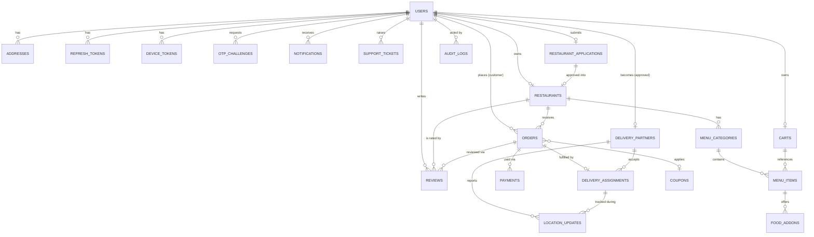

# Entity Relationship Design (ERD)

## 1. Relationship Diagram

## 2. Collection Schemas (MongoDB / Mongoose)

Field types are indicative; all documents include `createdAt`/`updatedAt` (timestamps) and `_id: ObjectId` unless noted.

### 2.1 `users`
| Field | Type | Notes |
|---|---|---|
| role | enum(CUSTOMER, RESTAURANT, DELIVERY_PARTNER, ADMIN) | immutable after creation except by admin |
| name | string | |
| mobile | string, unique sparse | E.164, indexed |
| email | string, unique sparse | indexed |
| mobileVerified / emailVerified | boolean | |
| passwordHash | string, optional | reserved for admin/back-office login only |
| status | enum(ACTIVE, INACTIVE, SUSPENDED) | |
| restaurantId | ObjectId ref restaurants | present only for RESTAURANT role |
| deliveryPartnerId | ObjectId ref deliveryPartners | present only for DELIVERY_PARTNER role |
| lastLoginAt | date | |

### 2.2 `otpChallenges`
| Field | Type | Notes |
|---|---|---|
| target | string | mobile or email |
| channel | enum(SMS, EMAIL) | |
| purpose | enum(LOGIN, VERIFY_MOBILE, VERIFY_EMAIL) | |
| codeHash | string | never store plaintext OTP |
| attempts | number | capped, e.g. max 5 |
| expiresAt | date | MongoDB TTL index drives expiry/cleanup directly; no external cache |
| consumedAt | date, nullable | |

### 2.3 `refreshTokens`
| Field | Type | Notes |
|---|---|---|
| userId | ObjectId ref users | |
| tokenHash | string | raw token never stored |
| deviceId | string | groups sessions per device |
| userAgent / ip | string | for session/device management UI |
| expiresAt | date | TTL index |
| revokedAt | date, nullable | rotation-on-use invalidates prior token |

### 2.4 `deviceTokens`
| Field | Type | Notes |
|---|---|---|
| userId | ObjectId ref users | |
| fcmToken | string | |
| platform | enum(WEB, ANDROID, IOS) | |
| lastSeenAt | date | |

### 2.5 `addresses`
| Field | Type | Notes |
|---|---|---|
| userId | ObjectId ref users | |
| label | string | Home/Work/Other |
| line1, line2, city, state, pincode | string | |
| geo | GeoJSON Point | `2dsphere` index |
| isDefault | boolean | |

### 2.6 `restaurantApplications`
| Field | Type | Notes |
|---|---|---|
| applicantUserId | ObjectId ref users | |
| ownerDetails | object (name, mobile, email, idProof) | |
| restaurantDetails | object (name, cuisine[], description) | |
| address | object + GeoJSON Point | |
| documents | array of {type, url} | Cloudinary/S3 URLs |
| bankDetails | object (accountNumber(masked/encrypted), ifsc, accountHolder) | encrypted at rest |
| status | enum(PENDING, APPROVED, REJECTED) | |
| reviewedBy | ObjectId ref users, nullable | admin |
| reviewNotes | string | |

### 2.7 `restaurants`
| Field | Type | Notes |
|---|---|---|
| ownerUserId | ObjectId ref users | |
| applicationId | ObjectId ref restaurantApplications | |
| name, description, cuisines[] | | |
| address | object + GeoJSON Point | `2dsphere` index |
| documents, bankDetails | | copied/confirmed from application |
| status | enum(APPROVED, SUSPENDED) | inactive restaurants soft-disabled, not deleted |
| isOpen | boolean | restaurant-controlled toggle |
| avgPrepTimeMinutes | number | |
| rating | {avg, count} | denormalized from reviews |
| commissionPercent | number | admin-configurable override of platform default |

### 2.8 `menuCategories`
| Field | Type | Notes |
|---|---|---|
| restaurantId | ObjectId ref restaurants | |
| name | string | |
| sortOrder | number | |

### 2.9 `menuItems`
| Field | Type | Notes |
|---|---|---|
| restaurantId | ObjectId ref restaurants | |
| categoryId | ObjectId ref menuCategories | |
| name, description | string | text-indexed for search |
| price | number (paise/integer) | store smallest currency unit |
| images[] | string URLs | |
| isVeg | boolean | |
| isAvailable | boolean | |
| variations[] | array {name, priceDelta} | e.g. Half/Full |
| addonGroupIds[] | ObjectId ref foodAddons | |
| prepTimeMinutes | number | |

### 2.10 `foodAddons`
| Field | Type | Notes |
|---|---|---|
| restaurantId | ObjectId ref restaurants | |
| groupName | string | e.g. "Extra Toppings" |
| options[] | array {name, price} | |
| maxSelectable | number | |

### 2.11 `carts`
| Field | Type | Notes |
|---|---|---|
| userId | ObjectId ref users, unique | one active cart per customer |
| restaurantId | ObjectId ref restaurants | single-restaurant cart |
| items[] | array {menuItemId, name, price, qty, selectedVariation, selectedAddons[], instructions} | denormalized snapshot for display; re-validated at checkout |
| couponCode | string, nullable | |

### 2.12 `orders`
| Field | Type | Notes |
|---|---|---|
| customerId | ObjectId ref users | |
| restaurantId | ObjectId ref restaurants | |
| items[] | array {menuItemId, nameSnapshot, priceSnapshot, qty, variationSnapshot, addonsSnapshot[], instructions} | **immutable historical snapshot** |
| deliveryAddressSnapshot | object | copied at order time |
| pricing | {itemsTotal, deliveryCharge, taxes, discount, grandTotal} | integer minor units |
| couponCode | string, nullable | |
| paymentMethod | enum(UPI, CARD, NETBANKING, COD) | |
| status | enum | see `ORDER-STATE-MACHINE.md` |
| statusHistory[] | array {status, at, actorRole, actorId, reason} | audit trail |
| assignedDeliveryPartnerId | ObjectId ref deliveryPartners, nullable | |
| deliveryOtpHash | string, nullable | verified at hand-off to customer |
| cancellation | {cancelledBy, reason, at}, nullable | |

### 2.13 `payments`
| Field | Type | Notes |
|---|---|---|
| orderId | ObjectId ref orders | |
| gateway | enum(RAZORPAY, CASHFREE, COD) | |
| gatewayOrderId / gatewayPaymentId | string | |
| amount | number | |
| status | enum(INITIATED, SUCCESS, FAILED, REFUND_PENDING, REFUNDED) | |
| webhookEventIds[] | string[] | for idempotency de-duplication |
| verifiedAt | date | set only after server-side signature/API verification |
| refunds[] | array {amount, reason, gatewayRefundId, status, at} | |

### 2.14 `deliveryPartners`
| Field | Type | Notes |
|---|---|---|
| userId | ObjectId ref users | |
| personalDetails, vehicleDetails, documents[], bankDetails | | |
| status | enum(PENDING, APPROVED, REJECTED, SUSPENDED) | approval workflow |
| availability | enum(AVAILABLE, BUSY, OFFLINE) | current dispatch state |
| currentLocation | GeoJSON Point, nullable | last known, `2dsphere` index |
| rating | {avg, count} | |

### 2.15 `deliveryAssignments`
| Field | Type | Notes |
|---|---|---|
| orderId | ObjectId ref orders | |
| partnerId | ObjectId ref deliveryPartners | |
| status | enum(OFFERED, ACCEPTED, DECLINED, ARRIVED_AT_RESTAURANT, PICKED_UP, ARRIVED_AT_CUSTOMER, DELIVERED, CANCELLED) | |
| offeredAt, respondedAt, pickedUpAt, deliveredAt | date | |
| otpVerifiedAt | date, nullable | |

### 2.16 `locationUpdates`
| Field | Type | Notes |
|---|---|---|
| assignmentId | ObjectId ref deliveryAssignments | |
| partnerId | ObjectId ref deliveryPartners | |
| point | GeoJSON Point | `2dsphere`, short TTL retention (e.g. 24–48h) then archived/pruned |
| recordedAt | date | |

### 2.17 `coupons`
| Field | Type | Notes |
|---|---|---|
| code | string, unique | |
| discountType | enum(PERCENT, FLAT) | |
| value, maxDiscount, minOrderValue | number | |
| validFrom, validTo | date | |
| usageLimitPerUser, totalUsageLimit | number | |
| applicableRestaurantIds[] | ObjectId[] | empty = platform-wide |
| isActive | boolean | |

### 2.18 `reviews`
| Field | Type | Notes |
|---|---|---|
| orderId | ObjectId ref orders, unique | one review per order |
| customerId, restaurantId | ObjectId | |
| rating | number 1-5 | |
| comment | string | |
| deliveryPartnerRating | number 1-5, nullable | |

### 2.19 `notifications`
| Field | Type | Notes |
|---|---|---|
| userId | ObjectId ref users | |
| channel | enum(PUSH, SMS, EMAIL, IN_APP) | |
| type | string | e.g. ORDER_PLACED |
| payload | object | |
| status | enum(QUEUED, SENT, FAILED) | |
| readAt | date, nullable | |

### 2.20 `auditLogs`
| Field | Type | Notes |
|---|---|---|
| actorUserId | ObjectId ref users | |
| action | string | e.g. `ORDER_CANCEL_ADMIN` |
| targetType, targetId | string / ObjectId | |
| metadata | object | before/after where relevant |
| ip, userAgent | string | |

### 2.21 `supportTickets`
| Field | Type | Notes |
|---|---|---|
| raisedBy | ObjectId ref users | |
| orderId | ObjectId ref orders, nullable | |
| subject, description | string | |
| status | enum(OPEN, IN_PROGRESS, RESOLVED, CLOSED) | |
| assignedTo | ObjectId ref users, nullable | admin/support staff |

## 3. Indexing Notes

- Geo queries: `2dsphere` on `restaurants.address.geo`, `addresses.geo`, `deliveryPartners.currentLocation`, `locationUpdates.point`.
- Search: text indexes on `menuItems.name/description` and `restaurants.name/cuisines` as the initial MongoDB text/Atlas Search source.
- TTL indexes: `otpChallenges.expiresAt`, `refreshTokens.expiresAt`, `locationUpdates.recordedAt` (bounded retention).
- Uniqueness: `users.mobile`, `users.email` (sparse), `coupons.code`, `carts.userId`, `reviews.orderId`.
