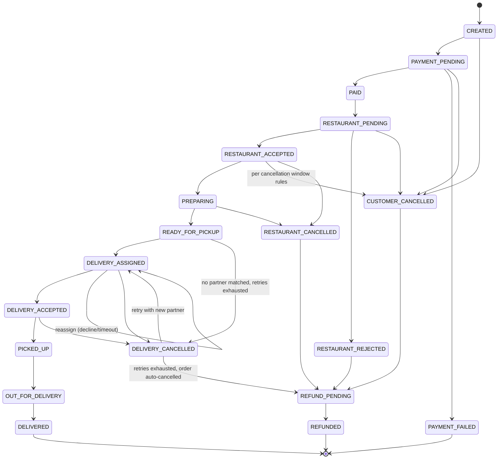

# Order State Machine

## 1. Ownership

The **backend** (`orders` module) is the sole authority for order state transitions. The frontend only requests transitions via specific action endpoints (e.g. `POST /orders/:id/accept`); it never sends an arbitrary `status` value, and any such field in a request body is stripped/rejected by the request-validation middleware (Zod/Joi schema in `strict`/`stripUnknown` mode).

## 2. Main Flow



## 3. State Definitions

| State | Meaning | Set by |
|---|---|---|
| CREATED | Order draft created from cart at checkout, before payment | Customer action |
| PAYMENT_PENDING | Payment initiated with gateway, awaiting confirmation | System (payment module) |
| PAYMENT_FAILED | Gateway reported failure / verification failed | System (webhook/verify) — terminal, cart restored |
| PAID | Payment verified server-side (or COD confirmed) | System |
| RESTAURANT_PENDING | Order sent to restaurant, awaiting accept/reject | System |
| RESTAURANT_ACCEPTED | Restaurant accepted, prep time set | Restaurant |
| RESTAURANT_REJECTED | Restaurant declined (reason required) | Restaurant — triggers refund if paid |
| PREPARING | Kitchen actively preparing | Restaurant |
| READY_FOR_PICKUP | Food ready, awaiting delivery pickup | Restaurant |
| DELIVERY_ASSIGNED | System offered assignment to a partner | System (assignment engine) |
| DELIVERY_ACCEPTED | Partner accepted assignment | Delivery partner |
| PICKED_UP | Partner confirmed pickup from restaurant | Delivery partner |
| OUT_FOR_DELIVERY | Partner en route to customer | Delivery partner |
| DELIVERED | Delivery OTP verified / marked delivered | Delivery partner |
| CUSTOMER_CANCELLED | Cancelled by customer within allowed window | Customer (or Admin on behalf) |
| RESTAURANT_CANCELLED | Cancelled by restaurant after acceptance (exception case) | Restaurant/Admin |
| DELIVERY_CANCELLED | Partner cancelled/failed assignment, or no partner could be assigned at all | System/Admin — triggers a reassignment attempt while retries remain, otherwise continues to `REFUND_PENDING` (§6) |
| REFUND_PENDING | Refund required, not yet processed by gateway | System |
| REFUNDED | Refund confirmed by gateway | System (webhook) |

## 4. Transition Rules (server-enforced)

- Every transition is validated against an explicit allow-list map `{fromState: [toState, ...]}` in the Orders service; any other request is rejected with `409 Conflict`.
- Each transition requires an authorized actor matching the ownership rules in `ROLE-PERMISSIONS.md` (e.g., only the assigned restaurant can move `RESTAURANT_PENDING → RESTAURANT_ACCEPTED`).
- `CUSTOMER_CANCELLED` is only permitted while state ∈ configurable cancellation-allowed set (default: up to `RESTAURANT_ACCEPTED`, blocked once `PREPARING`) — enforced via `config` (Admin-configurable cancellation rules).
- Every transition appends an entry to `order.statusHistory` (state, timestamp, actor, reason where applicable) — this is the audit trail, not mutable.
- Payment-affecting transitions (`PAID`, `PAYMENT_FAILED`, `REFUNDED`) can only be set by the Payments module after gateway verification/webhook — never directly by a controller responding to a client call claiming success.
- `PAID → RESTAURANT_PENDING` is chained automatically by the Orders service for every payment method — COD chains it inline at order creation (payment is already confirmed at placement time); online/gateway payments chain it from the same `markPaid()` method once the Payments module confirms success (via `POST /payments/:orderId/verify` or the signed webhook) — an order is never left sitting at `PAID`.
- Delivery reassignment (`DELIVERY_CANCELLED → DELIVERY_ASSIGNED`) is handled by a Node.js scheduled job (`node-cron`, e.g. every minute) that queries MongoDB for assignments needing reassignment, with a max retry count before escalating to Admin as an exception.

## 5. Order Timeout Safeguards (Node.js Scheduled Jobs / node-cron — no queue system)

- `RESTAURANT_PENDING` unaccepted beyond SLA → auto-flag for Admin, optionally auto-reject per config.
- `DELIVERY_ASSIGNED` unaccepted beyond SLA → auto reassign to next available partner.
- `READY_FOR_PICKUP` with no partner matched beyond SLA → run the next assignment round (see §6).
- `PAYMENT_PENDING` unresolved beyond SLA → auto-transition to `PAYMENT_FAILED` and release inventory/cart lock.

## 6. Delivery-Assignment Failure (no partner available)

An order must never be left stuck because nobody could be found to deliver it. Two distinct stuck states are possible and both are covered by the same bounded-retry loop:

- The matcher found **zero eligible partners**, so the order never left `READY_FOR_PICKUP`.
- Offers were made but **nobody accepted** within the SLA, so the order is sitting at `DELIVERY_ASSIGNED`.

### Retry rounds

- `MAX_DELIVERY_REASSIGN_ATTEMPTS` (default 5) counts **assignment rounds**, not offer documents. A single round that offers the order to five partners consumes **one** attempt.
- The round counter lives on the order itself (`order.deliveryAssignmentAttempts`), incremented atomically (`$inc`) exactly once per round.
- Round 1 runs inline when the restaurant marks the order ready. Every later round is driven by the existing every-minute `node-cron` job, gated by `DELIVERY_ACCEPT_SLA_MINUTES` (default 5), so rounds are spaced roughly one SLA window apart.
- Each round excludes partners who already saw this order, preserving the existing exclusion behavior.

### While retries remain

The order stays in its current state and the customer sees a neutral, friendly message ("Food is ready — finding a delivery partner"). Partner ids, retry counts, matcher internals, and assignment errors are never exposed to the customer.

### When the final round fails

The order is auto-cancelled by the backend (actor `SYSTEM`) along the path:

```text
READY_FOR_PICKUP | DELIVERY_ASSIGNED  ->  DELIVERY_CANCELLED  ->  REFUND_PENDING
```

Both hops go through the normal `assertTransition` allow-list and append to `statusHistory`; nothing mutates `status` directly. `DELIVERY_CANCELLED` is a pass-through, never a resting state — the order always continues to `REFUND_PENDING`, and then to `REFUNDED` once the refund is settled through the existing Payments flow (gateway refund for online payments, cash-record reconciliation for COD — `paymentsService.refund()` already distinguishes the two).

The cancellation is **idempotent**: a later cron tick finds the order already past `READY_FOR_PICKUP`/`DELIVERY_ASSIGNED` and no-ops, so an order is never cancelled — or refunded — twice.

### Side effects

| Actor | Effect |
|---|---|
| Customer | Order shows as cancelled with the reason; in-app + push notification via the existing dispatch service; refund follows the normal refund state machine. |
| Restaurant | Dedicated "order cancelled because a delivery partner could not be assigned" notification; the order is terminal, so `mark-preparing`/`mark-ready`/accept are all rejected with `409` by the transition allow-list. |
| Delivery partners | All still-open `OFFERED` assignments are set to `CANCELLED` and an `assignment:cancelled` Socket.IO event is emitted to each; no new assignment is created, and accepting a cancelled offer fails. |
| Admin | Audit-log entry `ORDER_AUTO_CANCELLED_NO_DELIVERY_PARTNER` (SYSTEM actor) recording the reason and the final attempt count; `order.deliveryAssignmentAttempts` and the assignment history remain queryable. |
